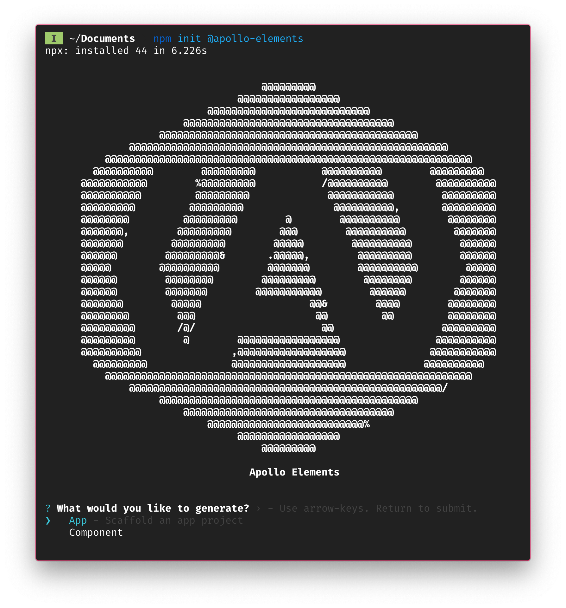

# Generator || 10

Apollo element's generator CLI has two primary modes: [app mode](./app.md) for scaffolding app projects and [component mode](./component.md) for generating components within an app.
