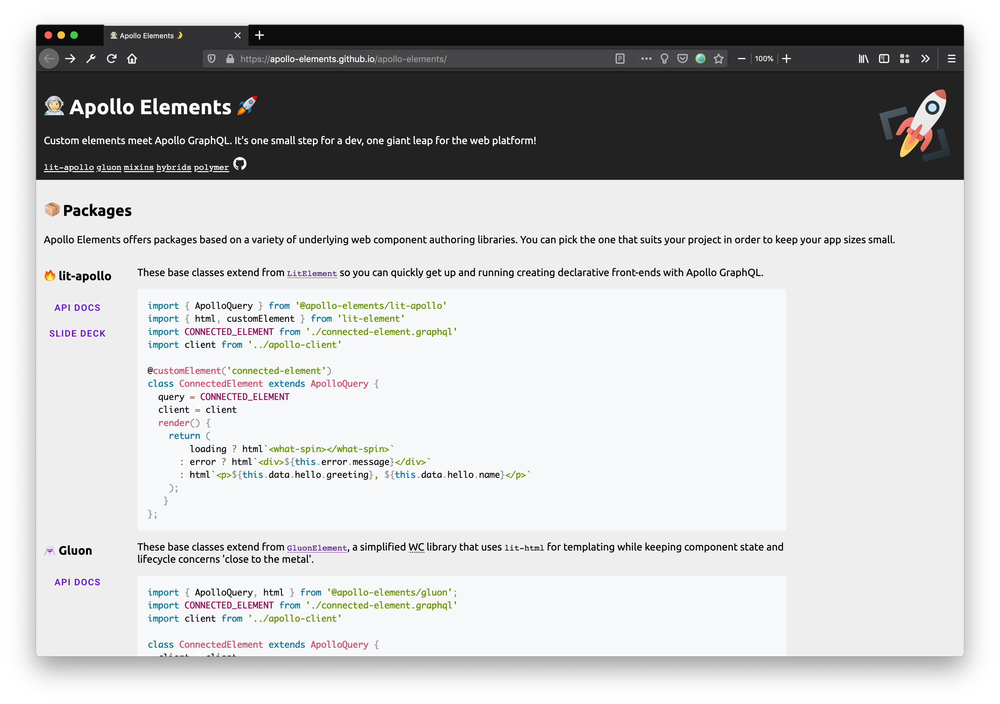
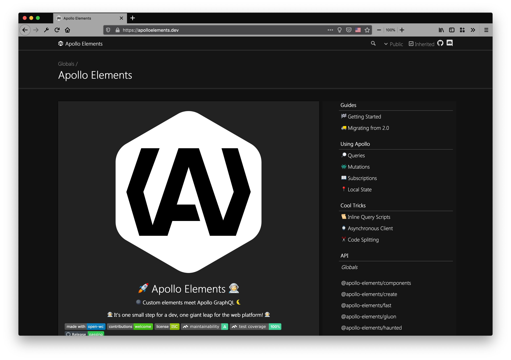

Apollo Elements' new docs site launches aboard the [Modern Web Rocket](https://wip-rocket.netlify.app/). It's a ground-up rewrite that puts users first and presents the best of what Apollo Elements has to offer. The new site has [live code demos](#live-demos-via-webcomponentsdev), [API tables](/api/) generated from custom elements manifest files, a new light theme, [customizable snippet browser](#code-tabs), comprehensive component lifecycle documentation for [query](/guides/building-apps/queries/lifecycle/), [mutation](/guides/building-apps/mutations/lifecycle/), and [subscription](/guides/building-apps/subscriptions/lifecycle/) elements, and more.

Read on to learn a little how the site was made, or just [dive in to the docs](https://apolloelements.dev)

## Live Demos via [webcomponents.dev](https://webcomponents.dev)

The new site comes packed with live demos of query and mutation components. You'll find them in the guides pages and on the API docs, and even showing off framework interop on the front page. The &lt;div>Riots team were incredibly helpful and accomodating. If you haven't tried out their stuff, give it a shot soon, it's quality software. One note, I have a lot of plans in this regard, so stay in touch.

```ts wcd LO2h5x8jgucn83YKGNeB src/Hello.ts
import { useQuery, component, html } from '@apollo-elements/haunted';

import { HelloQuery } from './Hello.query.graphql';

function HelloQueryElement() {
  const { data } = useQuery(HelloQuery, {
    variables: {
      name: 'Partner',
      greeting: 'Howdy',
    }
  });

  const greeting = data?.hello?.greeting ?? 'hello';
  const name = data?.hello?.name ?? 'world';

  return html`
    <span id="hello">
      ${greeting}, ${name}!
    </span>
  `;
}

customElements.define('hello-query', component(HelloQueryElement));
```

## Progressively Enhanced Code Snippets

### Code Copy

Let's face it, when you come to a docs site, 90% of the time you're looking to copy a code snippet 😉. I get it, "great artists steal", etc. At first I wrapped markdown content in custom elements, and this did the trick.

`````markdown
<code-copy>

```html
<p>Hello, World!</p>
```

</code-copy>
`````

The "copy code" buttons sprinkled throughout the site are just that, content wrapped in custom elements.

The only downside to this approach was for me the author, since it added a bunch of noise to the markdown source. Using a technique called mdjs pioneered by my colleague Thomas Allmer, the founder of [Open Web Components](https://open-wc.org), I kept the custom elements but simplified the DX:

`````markdown
```html copy
<p>Hello, World!</p>
```
`````

This produces the exact same HTML output as above, but with a much cleaner source format. The plugin which enables this lets me define arbitrary code mods for fenced code blocks, which I did for the code tabs and live demos.

### Code Tabs

One of the guiding philosophies in this project is to give users more options. Want to create vanilla HTML elements? Use the [mixins](/api/libraries/mixins/)! Don't want to use a global apollo client? Try the [`<apollo-client>`](/api/components/apollo-client/). I wanted the docs site to reflect that, letting the user choose how they want to view the code examples.

Inspired by sites like the [Stripe API Docs](https://stripe.com/docs/api/authentication?lang=php), which let you choose which SDK to view snippets for, I developed the `<code-tabs>` web component. When users pick a library (e.g. `lit-apollo` or `haunted`), every other instance of `<code-tabs>` on the page updates and their preference is stored in localStorage.

`````markdown
<code-tabs collection="web-langs">

```html tab markup
<title-crawl>Hello, World</title-crawl>
```

```css tab style
title-crawl { color: rebeccapurple; }
```

```js tab behaviour
import './title-crawl.js';
```

</code-tabs>
`````

Authors just specify which tab collection the element represents, and a Rocket/11ty plugin translates that to HTML. Specifically, each of those fenced code blocks gets translated to something like this HTML:

```html
<code-tab tab="html"
    data-item-index="0"
    data-id="markup"
    data-label="Markup"
    data-icon-href="/html-logo.svg"
    data-synonyms="html,structure"
    selected>
  <pre class="language-html"><!-- parsed markdown snippet --></pre>
</code-tab>
```

## Where We've Come From

The original docs site was a simple affair composed of hand-written HTML, markdown code blocks, and API sheets generated by the good-old Polymer analyzer.

While it did the job, the tooling was growing rapidly out of date, so earlier in the year I upgraded the site using [TypeDoc](https://typedoc.org) and the [TypeDoc Pages](https://mipatterson.github.io/typedoc-plugin-pages/index.html) plugin for guides. The TypeDoc version of the site came with a bevy of new content: getting started guides, info about managing local state, considerations for building and bundling, etc. It was a major step forward for content, and the authoring experience with markdown and TypeDoc was great, but there were some major drawbacks.

Build times were slow - sometimes five minutes - due to some hacks for cleaning up the final output. Worse was that users found it difficult to navigate, and ultimately the site failed to do what it set out to do - explain what Apollo Elements is and how to use it.

| Original | TypeDoc |
| -------- | ------- |
|  |  |

I was pleased to get some specific and actionable feedback from several users. That spurred me on to take the next step. Fortunately, the tools I needed to do the job emerged just at that time.

## 11ty and Rocket
Throughout this period, my colleagues at [Open Web Components](https://open-wc.org) were working on an alpha version of an 11ty meta-framework called [Rocket](https://wip-rocket.netlify.app/) for publishing multipage sites, geared especially (though not exclusively) towards web component authors. I decided to take a look.

If you've never heard of [11ty](https://www.11ty.dev/) go check it out, it's been generating quite the buzz, and for good reason. It's superlative, astounding, ebullient fun. On more than one occasion while building this site I had to tear myself away to get other projects done. I also got to know [nunjucks](https://mozilla.github.io/nunjucks/), an HTML templating language with a silly name made by Mozilla. How cool!

{{ 'rocket' | icon }}

Rocket is a modular system with overridable templates, which means you can pick and choose features you want a la carte, then customize them to suit your needs. And customize I did! As well as the code mods mentioned above, I added an 11ty filter to automatically [import web component definitions](https://github.com/jdvivar/eleventy-plugin-add-web-component-definitions/pull/5) whenever they're used in a page's HTML, and another filter to [automatically link type names](https://github.com/apollo-elements/apollo-elements/blob/2fe8f5b983ea3c2403150c0a8ad3443e2c607c83/packages/docs/rocket-plugins/link-to-type.mjs#L1) in TypeScript code blocks to their external API docs. All of those were good fun, but the secret sauce that makes this site useful is the [API docs](/api/) section.

## Custom Elements Manifest

The new site's API docs are based on the new v1 specification for [custom elements manifests](https://github.com/webcomponents/custom-elements-manifest), aka `custom-elements.json`, rather than direct introspection of classes à la TypeDoc. This means the docs are much more user-oriented, as they document the public methods and properties that users are most interested in, cutting out the noise of class heirarchies and overly-detailed type relationships.

There's strong tooling support for the previous v0 custom-elements.json format. While efforts are underway to develop an analyzer that outputs the new spec, I hand-wrote the manifests for this site, along with some automated transforms to express inheritance.

{{ 'robot' | icon }}

Because Apollo Elements is a collection of packages that all implement the same interfaces, the data flow for custom elements manifests was mostly top-down. The hand-written `packages/interfaces/custom-elements-manifest.json`, is the primary source-of-truth. I copy it into the library packages, applying transforms that preserve inheritance and account for library-specific quirks to `docs/_data/@apollo-elements/*/custom-elements-manifest.json`.

There are some features of the docs which aren't specified by custom-elements-manifest, like ['named parameters'](https://2ality.com/2011/11/keyword-parameters.html). For those, I relied on the TypeScript type of the parameter, writing a transform which scans for param and return types, inserting a markdown document as the object's `description` field in the manifest. So far those references are by type name, and I maintain a single flat list of typenames, held as markdown documents in a directory. If I run into name collisions down the line, I'll have to rethink that.

From there, I created a self-contained Rocket preset containing njk templates, 11ty filters, and custom elements. The preset turns the manifest data into progressively-enhanced HTML, based on the markdown file structure in your 11ty directory. I hope to publish this preset soon, so other web component authors can use it on their sites.

Some major remaining hurdles:
- 🎨 Customizing / hooking in to 11ty's layout phase from the markdown content (e.g. "put this markdown content inside this layout block" or "render that layout block at this point in the markdown" or "use the layout content when building the page nav")
- 📪 When tools catch up to the new spec, it seems to me that i'll still need to do some post processing in order to build in those markdown tables. The use case here is documenting 'named parameters' or return types which are 'property bags'
- 🚩 Some missing or unspecified flags on entities in the manifest spec (e.g. async, readonly) - issues opened (edited)
- 📦 The structure of the API docs pages assumes one export per file and packages with index.js entrypoints. This doesn't cover every use case and will need to be reconsidered before publishing a generalized version.

If you want to get involved, join the [web components community group](https://github.com/w3c/webcomponents-cg).

## Challenges and Awful Hacks

Along the way I met with some challenges. The `<type-doc>` web component I developed for the API docs produced a <abbr title="flash of unstyled content">FOUC</abbr> when the page loaded, before the custom element upgraded. To prevent this, I set its opacity to 0 until it became `:defined`, but this harmed `<noscript>` users. My solution was to add a special noscript stylesheet. Some more [work is needed on the platform side](https://gist.github.com/bkardell/5583179826456ff799433c50b09410f1) to address this issue all the way, but this is a decent workaround in the mean time.

While I sorta dunked on TypeDoc a few paragraphs back for requiring hacks, they don't deserve it. TypeDoc is a great project and they're making really nice software, it just didn't exactly fit my use. And what's more, there were plenty of awful hacks needed on the 11ty side, to render the navigation menu using headings from the nunjucks layouts (i.e. not only from markdown content), and to copy in the custom element manifests on write. On the whole though, I found the workarounds I needed to employ with Rocket and 11ty to be fewer and less cringe-worthy, so 👍 to them!

## The Future
There's still more work to do. Rocket is still in pre-release, and the work done here on Custom Elements manifests is preliminary as well. I'll need to publish and integrate the `<code-copy>` and `<code-tabs>` components into rocket, and gather some more use cases and insights around API docs, especially when it comes to mapping a single custom elements manifest to one-or-more docs pages.

## Acknowledgements
A number of people provided invaluable feedback on the site while it was under development, among them [Justin Fagnani](https://twitter.com/justinfagnani) from the Polymer team, [Peter Siska](https://github.com/peschee) from [Inventage](https://inventage.com/), and Vignesh from [Timecampus](https://twitter.com/timecampus) provided invaluable feedback. Check out Vignesh' [blog series on GraphQL](https://medium.com/timecampus/graphql-diving-deep-c7c0abe608b2). Uri and Dotan at [The Guild](https://the-guild.dev/) provided encouragement and resources. If you're working with GraphQL, give The Guild a glance, you'll be glad you did. My collegues on the [Open Web Components](https://open-wc.org) team were instrumental, as always, to everything I accomplished here.

<style data-helmet>
  .icon.rocket {
    float: right;
    width: 150px;
    opacity: 0.75;
  }

  .icon.robot {
    width: 200px;
    opacity: 0.75;
    float: left;
    display: block;
    margin: 10px;
  }
</style>
