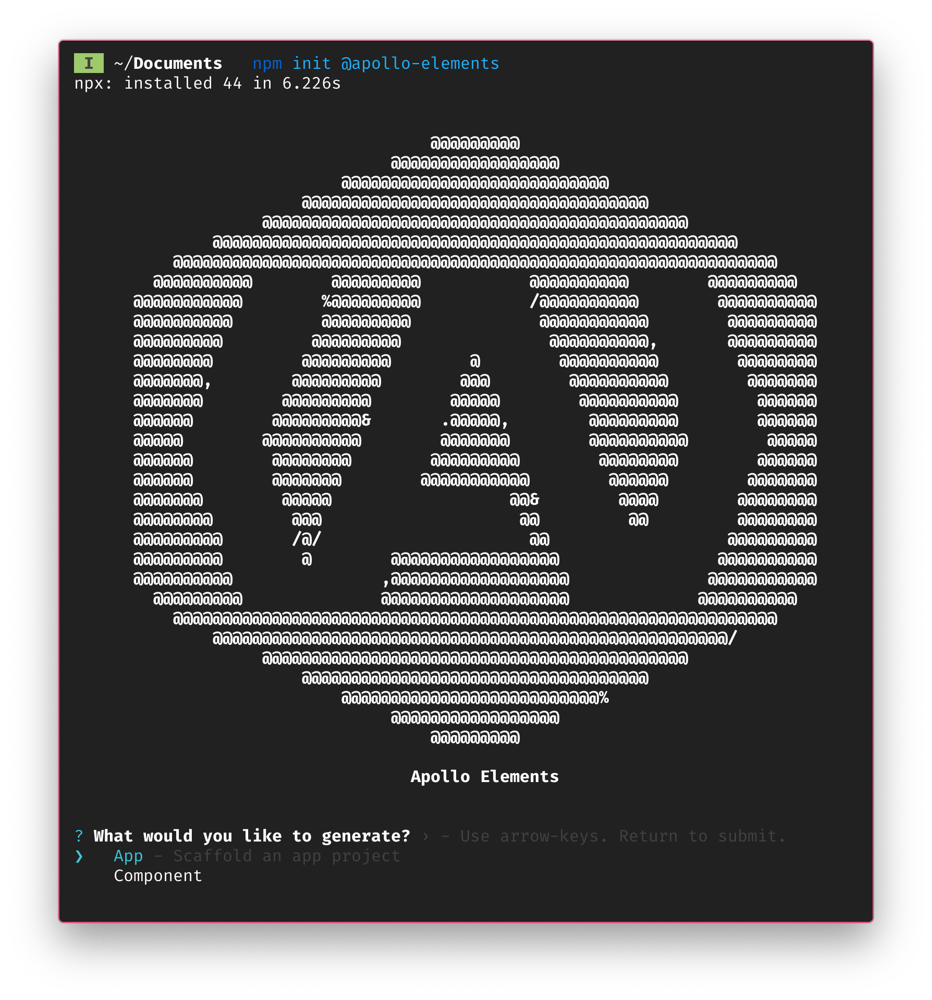

## @apollo-elements/create

<div align="center">
  
</div>

[](https://www.npmjs.com/package/@apollo-elements/create)
[](https://www.webcomponents.org/element/@apollo-elements/create)
[](https://github.com/apollo-elements/apollo-elements/blob/main/LICENCE.md)
[](https://github.com/apollo-elements/apollo-elements/actions)

<strong>⚡️ App and Component Generator for Apollo Elements 🚀</strong>

> 🔎 Read the [Full API Docs](https://apolloelements.dev/api/libraries/create/) 🔎

To quickly get started with apollo-elements, generate a skeleton app with this command

```sh
npm init @apollo-elements
```

Which will prompt you to generate a full app, or a component thereof.

## App Generator

```sh
npm init @apollo-elements -- app
```

Generate an Apollo Elements Skeleton App

### Example

```sh
npm init @apollo-elements -- \
  app \
    --pkg-manager yarn \
    --uri '/graphql' \
    --install \
    --start \
    --overwrite
```

### Options

| Flag                 | Description                                            | type            | default |
| -------------------- | ------------------------------------------------------ | --------------- | ------- |
| `--help`             | Show help                                              | boolean         |         |
| `--version`          | Show version number                                    | boolean         |         |
| `--pkg-manager`      | Preferred package manager                              | `npm` or `yarn` | `npm`   |
| `--uri`, `-u`        | URI to your GraphQL endpoint                           | string          |         |
| `--overwrite`        | Overwrite existing files                               | boolean         |         |
| `--package-defaults` | Use default package.json fields (e.g. author, license) | boolean         |         |
| `--codegen`          | Run codegen after scaffolding files                    | boolean         | true    |
| `--install`, `-i`    | Automatically install dependencies                     | boolean         |         |
| `--start`, `-s`      | Launch the dev server after scaffolding                | boolean         |         |

### 🔋 Batteries Included

The generated app comes with plenty of bells-and-whistles:

-   TypeScript
-   Linting with eslint and an opinionated ruleset
-   Buildless development workflow with `@web/dev-server`
-   Minified production bundle
-   A basic Apollo Client instance
-   Simple, unopinionated SPA routing
-   Code-generated TypeScript typings for GraphQL documents
-   `import MyQuery from './My.query.graphql'`
-   `import styles from './my-element.css'`

### 🛎 Scripts

These npm scripts help you get your work done in style:

```sh
npm start
yarn start
```

runs the code generator and the development server in watch mode

```sh
npm run build
yarn build
```

bundles the app into `/build`. The build will bundle and minify your javascript, and minify your HTML. Just upload to your static file host and you're good.

```sh
npm run lint
yarn lint
```

Lint your app with an opinionated set of rules for JavaScript and TypeScript

```sh
npm test
yarn test
```

The generator currently doesn't offer strong opinions on testing your UI components, so `npm test` currently exist with an error code. For unit testing business logic (i.e. typePolicies), we recommend [@web/test-runner](https://modern-web.dev/guides/test-runner/getting-started/)

## Component Generator

```sh
npm init @apollo-elements -- component
```

Generate an Apollo Element

### Example

```sh
npm init @apollo-elements -- \
  component \
    --type mutation \
    --name x-user-profile \
    --subdir user \
    --schema-path '#schema' \
    --shared-css-path '#components/shared.css' \
    --variables '$input: UpdateProfileInput!' \
    --fields 'updateProfile(input: $input) { id }' \
    --no-codegen
    --overwrite
```

### Options

| Flag                | Description                                               | type                                   | default |
| ------------------- | --------------------------------------------------------- | -------------------------------------- | ------- |
| `--help`            | Show help                                                 | boolean                                |         |
| `--version`         | Show version number                                       | boolean                                |         |
| `--pkg-manager`     | Preferred package manager                                 | `npm` or `yarn`                        | `npm`   |
| `--type`, `-t`      | Element type                                              | `query`, `mutation`, or `subscription` | `query` |
| `--name`, `-n`      | Custom element tag name                                   | string                                 |         |
| `--subdir`, `-d`    | Optional subdir under src/components                      | string                                 |         |
| `--overwrite`       | Overwrite existing files                                  | boolean                                | false   |
| `--codegen`         | Run codegen after scaffolding files                       | boolean                                | true    |
| `--schema-path`     | Optional custom path to schema types file                 | string                                 |         |
| `--shared-css-path` | Optional custom path to shared component styles file      | string                                 |         |
| `--variables`       | Optional custom variables e.g. `input: $UpdateUserInput`  | string                                 |         |
| `--fields`          | Optional custom fields e.g. `id name picture { alt url }` | string                                 |         |
