<meta name="description" content="Some advanced recipes for Apollo Elements to manage local state"/>

Say your app has Networks and Sites. A network has a list of Sites which belong to it, so you implement a field `isInNetwork` on Site which takes a network ID. You want to implement <dfn><abbr title="Create, Read, Update, Delete">CRUD</abbr></dfn> operations for Networks.

## The Setup - A list of Sites

<code-copy>

```graphql
type Site {
  id: ID
  name: String
  isInNetwork(networkId: ID): Boolean
}

type Network {
  id: ID
  name: String
  sites: [Site]
}
```

</code-copy>

Let's start by querying for all existing sites

<code-copy>

```graphql
query CreateNetworkPageQuery {
  sites {
    id
    name
    selected @client
  }
}
```

</code-copy>

Then we'll define a component `all-sites` which fetches and displays the list of sites.

<code-tabs>
<code-tab library="mixins">

```ts
import { ApolloQueryMixin } from '@apollo-elements/mixins/apollo-query-mixin';

import type {
  SitesQueryData as Data,
  SitesQueryVariables as Variables
} from '../../schema';

interface ItemDetail {
  itemId: string;
  selected: boolean;
}

const template = document.createElement('template');
template.innerHTML = '<select-list></select-list>';

const itemTemplate = document.createElement('template');
itemTemplate.innerHTML = '<select-item></select-item>';

class SitesElement extends ApolloQueryMixin(HTMLElement)<Data, Variables> {
  #data: Data = null;

  query = SitesQuery;

  get data() { return this.#data; }

  set data(value: Data) {
    this.#data = value;
    this.render;
  }

  constructor() {
    super();
    this.attachShadow({ mode: 'open' });
    this.shadowRoot.append(template.content.cloneNode());
  }

  render() {
    const sites = this.data.sites ?? [];
    sites.forEach(site => {
      const existing = this.shadowRoot.querySelector(`[item-id="${site.id}"]`);
      if (existing) {
        if (site.selected)
          existing.setAttribute('selected', '');
        else
          existing.removeAttribute('selected');
      } else {
        const item = itemTemplate.content.cloneNode();
        item.setAttribute('item-id', site.id);
        item.setAttribute('item-name', site.name);
        item.addEventListener('select', this.onSelectItem.bind(this));
        this.shadowRoot.querySelector('select-list').append(item);
      }
    });
  }

  onSelectItem(event: CustomEvent<ItemDetail>) {
    this.client.writeFragment({
      id: `Site:${event.detail.itemId}`,
      fragment: gql`
        fragment siteSelected on Site {
          selected @client
        }
      `,
      data: {
        selected: event.detail.selected
      }
    })
  }
}

customElements.define('all-sites', SitesElement);
```

</code-tab>

<code-tab library="lit-apollo">

```ts
import { ApolloQuery, customElement, html } from '@apollo-elements/lit-apollo';
import type {
  SitesQueryData as Data,
  SitesQueryVariables as Variables
} from '../../schema';

interface ItemDetail {
  itemId: string;
  selected: boolean;
}

@customElement('all-sites')
class SitesElement extends ApolloQuery<Data, Variables> {
  query = SitesQuery;

  render() {
    return html`
      <select-list>
        ${this.data.sites.map(site => html`
        <select-item
            item-id="${site.id}"
            item-name="${site.name}"
            ?selected="${site.selected}"
            @select="${this.onSelectItem}"
        ></select-item>
        `)}
      </select-list>
    `;
  }

  onSelectItem(event: CustomEvent<ItemDetail>) {
    this.client.writeFragment({
      id: `Site:${event.detail.itemId}`,
      fragment: gql`
        fragment siteSelected on Site {
          selected @client
        }
      `,
      data: {
        selected: event.detail.selected
      }
    })
  }
}
```

</code-tab>
<code-tab library="fast">

```ts
import { ApolloQuery, customElement, html } from '@apollo-elements/fast';
import type {
  SitesQueryData as Data,
  SitesQueryVariables as Variables
} from '../../schema';

interface ItemDetail {
  itemId: string;
  selected: boolean;
}

@customElement({
  name: 'all-sites',
  template: html<SitesElement>`
    <select-list>
      ${x => data.sites.map(site => html<SitesElement>`
      <select-item
          item-id="${site.id}"
          item-name="${site.name}"
          ?selected="${site.selected}"
          @select="${(x, { event }) => x.onSelectItem(event)}"
      ></select-item>
      `)}
    </select-list>
  `,
})
class SitesElement extends ApolloQuery<Data, Variables> {
  query = SitesQuery;

  onSelectItem(event: CustomEvent<ItemDetail>) {
    this.client.writeFragment({
      id: `Site:${event.detail.itemId}`,
      fragment: gql`
        fragment siteSelected on Site {
          selected @client
        }
      `,
      data: {
        selected: event.detail.selected
      }
    })
  }
}
```

</code-tab>

<code-tab library="haunted">

```ts
import { useQuery, component, html } from '@apollo-elements/hybrids';
import type { ApolloQueryInterface } from '@apollo-elements/interfaces';
import type {
  SitesQueryData as Data,
  SitesQueryVariables as Variables
} from '../../schema';

interface ItemDetail {
  itemId: string;
  selected: boolean;
}

function AllSites() {
  const { data, client } = useQuery<Data, Variables>(SitesQuery);

  function onSelectItem(event: CustomEvent<ItemDetail>) {
    client.writeFragment({
      id: `Site:${event.detail.itemId}`,
      fragment: gql`
        fragment siteSelected on Site {
          selected @client
        }
      `,
      data: {
        selected: event.detail.selected
      }
    })
  }

  return html`
    <select-list>
      ${data.sites.map(site => html`
      <select-item
          item-id="${site.id}"
          item-name="${site.name}"
          ?selected="${site.selected}"
          @select="${onSelectItem}"
      ></select-item>
      `)}
    </select-list>
  `,
}

customElements.define('all-sites', component(AllSites));
```

</code-tab>

<code-tab library="hybrids">

```ts
import { client, query, define, html } from '@apollo-elements/hybrids';
import type { ApolloQueryInterface } from '@apollo-elements/interfaces';
import type {
  SitesQueryData as Data,
  SitesQueryVariables as Variables
} from '../../schema';

function onSelectItem(
  host: HTMLElement & ApolloQueryInterface<Data, Variables>>,
  event: CustomEvent<{ itemId: string, selected: boolean }>
) {
  host.client.writeFragment({
    id: `Site:${event.detail.itemId}`,
    fragment: gql`
      fragment siteSelected on Site {
        selected @client
      }
    `,
    data: {
      selected: event.detail.selected
    }
  })
}

define('all-sites', {
  client: client(window.__APOLLO_CLIENT__),
  query: query<Data, Variables>(SitesQuery),
  render: ({ data }) => html`
    <select-list>
      ${data.sites.map(site => html`
      <select-item
          item-id="${site.id}"
          item-name="${site.name}"
          selected="${site.selected}"
          onselect="${onSelectItem}"
      ></select-item>
      `)}
    </select-list>
  `,
});
```

</code-tab>
</code-tabs>

In order to create the Network, the user selects some Sites and then clicks a button which issues the `createNetwork` mutation, so let's implement that mutation now.

<code-copy>

```graphql
mutation CreateNetwork($sites: ID[]!) {
  createNetwork(sites: $sites) {
    id
    name
    sites {
      id
    }
  }
}
```

</code-copy>

This mutation requires an input which is a list of site IDs. In order to provide that list, our user will click on the checkboxes in the list of `<select-item>`s. This in turn will write to that `Site`'s client-side `selected @client` field on `Site`, which in turn will be read to determine whether a site's corresponding `<select-item>` component will be marked selected: Whenever the user clicks on an item in the list, `onSelectItem` writes the new selected state to the cache for that Site.



```mermaid
sequenceDiagram
    participant CA as Apollo Cache
    participant UI as <all-sites>
    participant OL as <select-item>
    CA->>UI: AllSitesQuery
    UI-->>OL: Property Assignment
    OL->>UI: MouseEvent
    UI-->>CA: writeFragment
```

Then, when the user is ready to create the Network, she clicks the `Create` button, and the component issues the mutation over the network with variables based on the currently selected sites.

<code-tabs>
<code-tab library="mixins">

```ts
import { ApolloQueryMixin } from '@apollo-elements/mixins/apollo-query-mixin';
import CreateNetworkMutation from './CreateNetwork.mutation.graphql';

import type {
  SitesQueryData as Data,
  SitesQueryVariables as Variables
} from '../../schema';

import '@apollo-elements/components/apollo-mutation';
import type { WillMutateEvent } from '@apollo-elements/components';

type CreateNetworkMutator =
  ApolloMutation<CreateNetworkMutationData, CreateNetworkMutationVariables>;

const template = document.createElement('template');
template.innerHTML = `
  <select-list></select-list>
  <apollo-mutation></apollo-mutation>
`;

template.content.querySelector<CreateNetworkMutator>('apollo-mutation')
  .mutation = CreateNetworkMutation;

class SitesElement extends ApolloQueryMixin(HTMLElement)<Data, Variables> {
  // snip

  constructor() {
    // snip
    this.shadowRoot.querySelector('apollo-mutation')
      .addEventListener('will-mutate', this.onWillMutate.bind(this));
  }

  onWillMutate(event: WillMutateEvent & { target: CreateNetworkMutator }) {
    event.target.variables = {
      sites: this.data.sites
        .filter(x => x.selected)
        .map(x => x.id); // string[]
    }
  }
```

</code-tab>

<code-tab library="lit-apollo">

```ts
import { ApolloQuery, customElement, html } from '@apollo-elements/lit-apollo';
import type {
  SitesQueryData as Data,
  SitesQueryVariables as Variables
} from '../../schema';

import '@apollo-elements/components/apollo-mutation';
import type { WillMutateEvent } from '@apollo-elements/components';

import CreateNetworkMutation from './CreateNetwork.mutation.graphql';

type CreateNetworkMutator =
  ApolloMutation<CreateNetworkMutationData, CreateNetworkMutationVariables>;

@customElement('all-sites')
class SitesElement extends ApolloQuery<Data, Variables> {
  query = SitesQuery;

  render() {
    return html`
      <select-list><!-- snip --></select-list>

      <apollo-mutation
          .mutation="${CreateNetworkMutation}"
          @will-mutate="${this.onWillMutate}">
        <button slot="trigger">Create</button>
      </apollo-mutation>
    `;
  }

  onSelectItem(event) {
    // snip
  }

  onWillMutate(event: WillMutateEvent & { target: CreateNetworkMutator }) {
    event.target.variables = {
      sites: this.data.sites
        .filter(x => x.selected)
        .map(x => x.id); // string[]
    }
  }
```

</code-tab>

<code-tab library="fast">

```ts
import { ApolloQuery, customElement, html } from '@apollo-elements/fast';
import type {
  SitesQueryData as Data,
  SitesQueryVariables as Variables
} from '../../schema';

import '@apollo-elements/components/apollo-mutation';
import type { WillMutateEvent } from '@apollo-elements/components';

import CreateNetworkMutation from './CreateNetwork.mutation.graphql';

type CreateNetworkMutator =
  ApolloMutation<CreateNetworkMutationData, CreateNetworkMutationVariables>;

@customElement({
  name: 'all-sites',
  template: html<SitesElement>`
    <select-list><!-- snip --></select-list>

    <apollo-mutation
        .mutation="${CreateNetworkMutation}"
        @will-mutate="${(x, { event }) => x.onWillMutate(event)}">
      <button slot="trigger">Create</button>
    </apollo-mutation>
  `,
})
class SitesElement extends ApolloQuery<Data, Variables> {
  query = SitesQuery;

  onSelectItem(event) {
    // snip
  }

  onWillMutate(event: WillMutateEvent & { target: CreateNetworkMutator }) {
    event.target.variables = {
      sites: this.data.sites
        .filter(x => x.selected)
        .map(x => x.id); // string[]
    }
  }
}
```

</code-tab>

<code-tab library="haunted">

```ts
import { useQuery, component, html } from '@apollo-elements/haunted';
import type {
  SitesQueryData as Data,
  SitesQueryVariables as Variables
} from '../../schema';

import type { WillMutateEvent } from '@apollo-elements/components';

import '@apollo-elements/components/apollo-mutation';

import CreateNetworkMutation from './CreateNetwork.mutation.graphql';

type CreateNetworkMutator =
  ApolloMutation<CreateNetworkMutationData, CreateNetworkMutationVariables>;

function AllSites() {
  const { data, client } = useQuery<Data, Variables>(SitesQuery);

  // snip...

  function onWillMutate(event: WillMutateEvent & { target: CreateNetworkMutator }) {
    event.target.variables = {
      sites: this.data.sites
        .filter(x => x.selected)
        .map(x => x.id); // string[]
    }
  }

  return html`
    <select-list><!-- snip --></select-list>

    <apollo-mutation
        .mutation="${CreateNetworkMutation}"
        @will-mutate="${this.onWillMutate}">
      <button slot="trigger">Create</button>
    </apollo-mutation>
  `;
}
```

</code-tab>
<code-tab library="hybrids">

```ts
import { client, query, define, html } from '@apollo-elements/hybrids';
import type { ApolloMutation } from '@apollo-elements/components';
import type {
  SitesQueryData as Data,
  SitesQueryVariables as Variables
} from '../../schema';

import '@apollo-elements/components/apollo-mutation';
import type { WillMutateEvent } from '@apollo-elements/components';

import CreateNetworkMutation from './CreateNetwork.mutation.graphql';

type CreateNetworkMutator =
  ApolloMutation<CreateNetworkMutationData, CreateNetworkMutationVariables>;

function onWillMutate(
  host: HTMLElement & ApolloQueryInterface<Data, Variables>,
  event: WillMutateEvent & { target: CreateNetworkMutator }
) {
  event.target.variables = {
    sites: host.data.sites
      .filter(x => x.selected)
      .map(x => x.id); // string[]
  }
}

define('all-sites', {
  client: client(window.__APOLLO_CLIENT__),
  query: query<Data, Variables>(SitesQuery),
  render: ({ data }) => html`
    <select-list><!-- snip --></select-list>

    <apollo-mutation
        .mutation="${CreateNetworkMutation}"
        @will-mutate="${onWillMutate}">
      <button slot="trigger">Create</button>
    </apollo-mutation>
  `,
})
```

</code-tab>
</code-tabs>

This is great for the `/create-network` page, but things get tricker when we want to implement the `updateNetwork` mutation on page `/update-network/:networkId`. Now we have to show the same `<select-list>` of Sites, but the `selected` property of each one has to relate only to the specific page the user is viewing it on.

In other words, if a user loads up `/create-network`, selects sites A and B, then loads up `/update-network/:networkId`, they shouldn't see A and B selected on that page. Then, if they select C and D on `/update-network/:networkId`, only to return to `/create-network`, they should only see A and B selected, not C and D.

In order to accomplish this, let's define the `<update-network-page>`'s query to pass a `networkId` argument to the client-side selected field

<code-copy>

```graphql
query UpdateNetworkPageQuery($networkId: ID!) {
  location @client {
    params {
      networkId @export(as: "networkId")
    }
  }

  sites {
    id
    name
    isInNetwork(networkId: $networkId)
    selected(networkId: $networkId)
  }

  network(networkId: $networkId) {
    id
    name
  }
}
```

</code-copy>

This query lets us combine a view of all Sites with their relationship to a particular Network.

Let's define a `FieldPolicy` for `Site`'s `selected` field which lets us handle both cases: the create page and the update page

<code-copy>

```ts
const typePolicies: TypePolicies = {
  Site: {
    fields: {
      selected: {
        keyArgs: ['networkId'],
        read(prev, { args, storage, readField }) {
          if (!args?.networkId)
            return prev ?? true;
          else {
            return storage[args.networkId] ?? readField({
              typename: 'Site',
              fieldName: 'isInNetwork',
              args: { networkId: args.networkId }
            });
          }
        },
        merge(_, next, { args, storage }) {
          if (args?.networkId)
            storage[args.networkId] = next;
          return next;
        },
      }
    }
  }
}
```

</code-copy>

With this type policy, any time the `selected` field is read without any args, or with no `networkId` arg, it will simply return the previous known value - in other words, a simple flag on the site object.
But if the field is queried with a `networkId` arg, as in the update-network page, instead of returning the 'global' value (`prev`), it will return the value stored at `storage[args.networkId]`, which is a `Record<string, boolean>`.